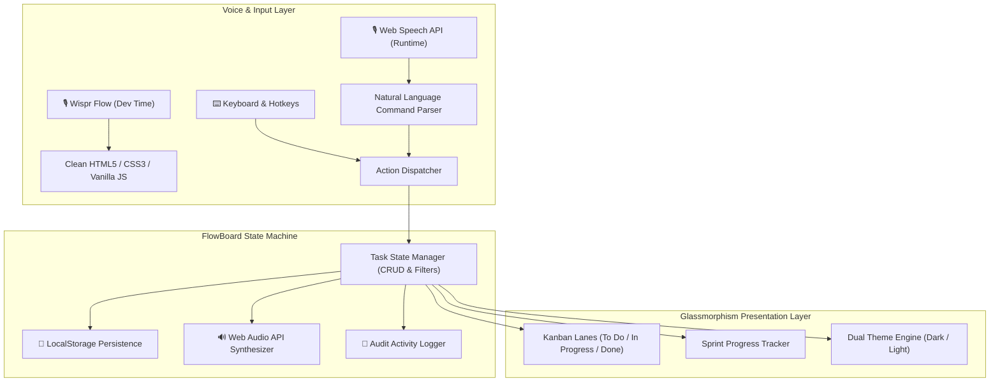

# ⚡ FlowBoard — Intelligent Voice-Driven Kanban Suite

> **Built 100% via Voice-Driven Engineering using [Wispr Flow](https://wisprflow.ai)**  
> *Developed for the Hacker House Goa 2026 (`HH Goa'26`) Wispr Flow Shortlisting Task*

[-6366f1?style=for-the-badge&logo=soundcharts&logoColor=white)](https://ref.wisprflow.ai/hhg)
[](LICENSE)
[-f59e0b?style=for-the-badge)](index.html)
[]()

---

## 🎯 The Vision: Voice-First Engineering

**FlowBoard** is a modern, high-performance Kanban productivity suite engineered to solve the disconnect between thought speed and developer execution. 

Instead of typing thousands of characters, **this entire project was designed, scaffolded, styled, and coded using voice-driven development powered by Wispr Flow.**

Furthermore, FlowBoard embraces a **"Meta-Voice Architecture"**: not only was it built using Wispr Flow, but the application itself embeds a **native real-time Voice Command Assistant & Speech Recognition Engine** directly in the browser!

---

## 🎬 Live Interactive Demo & Quick Start

### 🌐 Instant Browser Launch (Zero Install)
No build steps, no `node_modules`, no server required!
1. Clone the repository:
   ```bash
   git clone https://github.com/RajBarot3826/FlowBoard.git
   ```
2. Double click `index.html` or run with any lightweight server:
   ```bash
   python -m http.server 8000
   ```
3. Open `http://localhost:8000` in Google Chrome, Microsoft Edge, or Safari.

---

## ✨ Standout Features

### 🎙️ 1. Native Voice Assistant & Natural Language Parser
- **Voice Trigger**: Press <kbd>V</kbd> or click the glowing **"Voice Control"** button.
- **Real-Time Visual Waveform**: Floating glassmorphic banner transcribing speech with dynamic pulsing state.
- **Natural Language Parsing**:
  - *"Add task deploy authentication service due tomorrow"* $\rightarrow$ Creates task with tomorrow's date!
  - *"Create high priority task fix memory leak in worker"* $\rightarrow$ Automatically tags priority as 🔴 High!
  - *"Filter high priority"* / *"Filter overdue"* $\rightarrow$ Dynamically updates the board.
  - *"Switch to dark mode"* $\rightarrow$ Toggles theme instantly.
- **In-Field Mic Dictation**: Micro-mic buttons embedded inside task title & description inputs allow hands-free task writing!

### 🔊 2. Web Audio Acoustic Feedback (0 External Assets)
- Custom synthesizer built directly on the **Web Audio API**.
- Crisp acoustic tones for card drops, deletions, lane moves, and voice triggers.
- Mute/unmute toggle in header (<kbd>🔊</kbd> / <kbd>🔇</kbd>) with state persistence.

### ⚡ 3. Command Palette (`⌘K` / `Ctrl+K`)
- Linear & Raycast style command palette.
- Instant keyboard navigation to trigger any feature without lifting hands from keyboard.

### 📊 4. Live Sprint Progress & Metrics Dashboard
- Real-time sprint progress bar calculating project completion percentage.
- Breakdown counters for **Total Tasks**, **In Progress**, **Completed**, and **Overdue**.
- Overdue tasks highlighted with urgency tags and relative date formats.

### 🏷️ 5. Tags & Multi-Dimensional Filtering
- Color-coded tags: `Feature`, `Bug`, `Design`, `DevOps`, `Backend`.
- One-click filter chips + search bar debounced for instant results.

### 📜 6. Activity Audit Trail Drawer
- Slide-out timeline panel tracking all board operations.
- Voice-generated actions marked with special `🎙️` badges.

### 💾 7. Offline Backup, Restore & CSV Export
- **JSON Backup**: One-click full export of tasks, priorities, and activity logs.
- **JSON Restore**: Drag-and-drop backup file restore.
- **CSV Export**: Clean spreadsheet export compatible with Google Sheets & Excel.

### 🌓 8. Glassmorphic Dual Themes
- Automatic system-preference detection + manual toggle with local storage persistence.

---

## 🎙️ Natural Voice Commands Reference

Press <kbd>V</kbd> anywhere on the board and speak naturally:

| Voice Command | Action Performed |
|---|---|
| `"Create task build user profile due tomorrow"` | Adds task with automatic tomorrow date |
| `"Add high priority task fix database connection"` | Creates task with 🔴 High Priority |
| `"Search authentication"` | Real-time fuzzy search across all cards |
| `"Filter high priority"` / `"Filter overdue"` | Filters view to matching cards |
| `"Switch to dark mode"` / `"Light mode"` | Changes theme instantly |
| `"Export backup"` | Generates and downloads JSON backup |
| `"Open history"` | Slides open the activity audit log |
| `"Clear filter"` / `"Show all"` | Resets all active search and filters |

---

## ⌨️ Keyboard Shortcuts

| Shortcut | Description |
|---|---|
| <kbd>V</kbd> | Activate / Deactivate Voice Assistant |
| <kbd>N</kbd> | Open New Task modal |
| <kbd>⌘K</kbd> / <kbd>Ctrl+K</kbd> | Open Command Palette |
| <kbd>/</kbd> | Focus Search Bar |
| <kbd>H</kbd> | Open Activity Audit Log |
| <kbd>?</kbd> | Open Voice & Shortcuts Cheat Sheet |
| <kbd>Esc</kbd> | Dismiss any open modal / drawer / banner |

---

## 🏗️ System Architecture



---

## 📹 Voice Development Workflow (Video Demo Guide)

For the **Hacker House Goa Wispr Flow Shortlisting Task** video submission, this project demonstrates real voice-driven development:

1. **Ideation & Architecture by Voice**: Dictated component layout, color tokens, and state flow using Wispr Flow.
2. **Scaffolding HTML by Voice**: Voice dictation of semantic markup and ARIA accessibility tags.
3. **Styling with Voice-Driven CSS**: Dictated responsive CSS Grid and Flexbox rules, glassmorphism variables, and keyframe transitions.
4. **Interactive Logic Dictation**: Dictated ES6 classes, event listeners, Web Audio synthesis functions, and speech parsing regex.
5. **Real-Time Verification**: Live test in browser showing 0 console errors, instant drag & drop, and speech-driven automation.

---

## 🛠️ Tech Stack & Philosophy

- **Markup**: HTML5 (Semantic, accessible, screen-reader ready)
- **Styling**: Modern CSS3 (CSS Variables, Flexbox, CSS Grid, Glassmorphism backdrop-filters)
- **Scripting**: Pure Vanilla JavaScript (ES6+ Classes, zero build tools, zero dependencies)
- **Audio**: Web Audio API (real-time procedural frequency modulation)
- **Speech**: Web Speech API (`SpeechRecognition` with continuous fallbacks)
- **Storage**: Browser LocalStorage & HTML5 File API

---

## 📄 License

Distributed under the **MIT License**. See [`LICENSE`](LICENSE) for full details.

---

<p align="center">
  <b>FlowBoard</b> — Crafted with precision and voice using <b>Wispr Flow</b> for <b>Hacker House Goa 2026</b> 🚀
</p>
